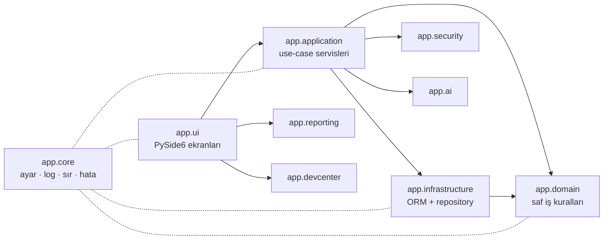
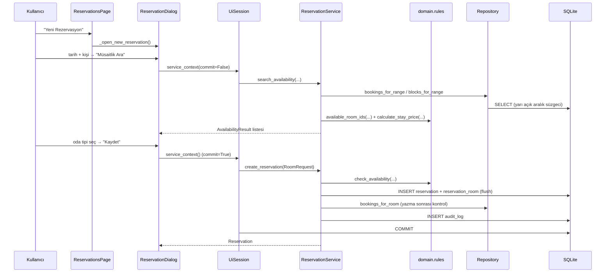

# Mimari

Bu belge, sistemin **neden** böyle kurulduğunu anlatır. Her teknik iddia
kaynak koddaki bir dosya/satırla veya çalıştırılabilir bir komutla
karşılanır; doğrulanamayan noktalar açıkça işaretlenmiştir.

Ölçüm anı: `git` HEAD = `16c599b`, 120 Python dosyası / 37.797 satır
(`app/`), 38 dosya / 10.944 satır (`tests/`).

```powershell
Get-ChildItem -Recurse -File app -Filter *.py | Measure-Object
```

---

## 1. Katmanlar

### Bağımlılık yönü



Kuralın kısa hâli, `CONTRIBUTING.md` ve
`app/infrastructure/db/repositories/__init__.py` içinde aynı cümleyle
yazılıdır:

```
ui -> application -> domain <- infrastructure
```

Okları tersine çeviren tek bir import bile kuralı bozar; bu yüzden ok
yönü kodun kendisinde de görülebilir olmalıdır (bkz. bölüm 2).

### Katman sorumlulukları

| Katman | Sorumluluğu | **Yapmadığı** |
|---|---|---|
| `app.core` | Yapılandırma (`config.py`), maskeli loglama (`log.py`), sır yönetimi (`secret_store.py`), ortak hata sınıfları (`exceptions.py`), yol çözümleme (`paths.py`) | Veritabanı bilmez, iş kuralı içermez |
| `app.domain` | Enum kataloğu, değer nesneleri (`Money`, `DateRange`), saf iş kuralları (`rules/availability.py`, `rules/pricing.py`, `rules/reservation_state.py`) | SQLAlchemy / PySide6 / FastAPI import **etmez**; oturum almaz, sorgu çalıştırmaz |
| `app.infrastructure` | ORM modelleri, özel sütun tipleri, motor/oturum yönetimi, repository'ler, demo veri üreteci | İş kuralı bilmez; **hiçbir repository `commit` etmez** — işlem sınırı çağırana aittir |
| `app.application` | Yetki kontrolü, işlem sınırı, repository'lerden veri toplayıp domain kuralına verme, sonucu kalıcılaştırma, denetim günlüğü | Domain kurallarını **tekrarlamaz**, yalnızca çağırır |
| `app.security` | Argon2id parola, izin kataloğu (`Perm`), rol tanımları, oturum, denetim günlüğü yazımı | Ekran çizmez |
| `app.reporting` | KPI formülleri (`kpi.py`, veritabanısız), rapor sorguları (`queries.py`), PDF/Excel/CSV dışa aktarma | `exporters` bilerek `__init__.py`'den **iç aktarılmaz**: `openpyxl`/`reportlab` ağırdır, yalnızca dışa aktarım anında yüklenmelidir |
| `app.ai` | Sağlayıcı adaptörleri, model kataloğu, yedek zinciri | Veritabanına **yazmaz**, iş kuralı uygulamaz, kullanıcı onayı istemez — bunlar servis katmanının işidir |
| `app.devcenter` | Komut politikası, kısıtlı terminal, diff hazırlama, Git koruması, kalite zinciri | Kullanıcı onayı olmadan **hiçbir baytı değiştirmez** |
| `app.ui` | PySide6 ekranları, diyaloglar, tema, biçimlendirme | İş kuralı içermez. Veri erişimi **kural olarak** `app.application.services` üzerinden yapılır — pratikte istisnaları vardır, bkz. aşağıdaki bölüm |

### Kuralın pratikteki istisnaları

`app/ui/__init__.py` docstring'i şunu söyler:

> Arayüz yalnızca `app.application.services` üzerinden veri okur/yazar;
> SQLAlchemy oturumuna doğrudan dokunmaz.

**Bu, bugünkü kodda tam olarak doğru değildir.** Ölçüm:

```powershell
Select-String -Path app\ui\*.py,app\ui\pages\*.py,app\ui\dialogs\*.py,app\ui\widgets\*.py -Pattern "from app\.infrastructure" | Measure-Object
# Count : 37
```

| Sapma | Nerede | Nasıl |
|---|---|---|
| Repository'nin doğrudan kullanımı | 8 dosyada 10 çağrı: `dashboard_page`, `reservations_page`, `rooms_page`, `frontdesk_page`, `checkin_dialog` (2), `folio_dialog`, `maintenance_dialog`, `reservation_dialog` (2) | Her zaman `service_context(...)` bloğu içinde ve `ctx.require(Perm.X)` çağrısından sonra; hepsi **salt okuma** (`search`, `list_rooms`, `arrivals_on`, `in_house_on`, `unsettled_folios`, `get_with_lines`) |
| Doğrudan ORM yazımı | `app/ui/pages/settings_page.py:951` — `ctx.session.add(record)` | Vergi oranı ekleme/güncelleme. Bir `SettingsService` yazılmadığı için ekran doğrudan `TaxRate` üzerinde çalışır; yetki kontrolü ve denetim kaydı yine yapılır |
| `session_scope`'un doğrudan açılması | `app/ui/login.py` (2), `app/ui/first_run.py`, `app/ui/session.py` | Giriş, ilk kurulum ve tesis seçimi — henüz bir kullanıcı bağlamı olmadığı için `service_context` kullanılamaz |
| ORM sınıfının tip olarak import edilmesi | `main_window.py`, `login.py`, `session.py`, çeşitli sayfa/diyaloglar | `User`, `Property`, `Reservation` gibi sınıflar tip ipucu veya doğrudan alan okuma için |

Yazma yolunun tamamı için kural **korunmaktadır**: rezervasyon, folyo,
check-in/out, misafir ve operasyon işlemlerinin hepsi servis üzerinden
geçer. Tek istisna yukarıdaki `settings_page.py` satırıdır.

Salt okuma tarafındaki sapma bilinçli görünüyor (liste ekranları için ayrı
bir "okuma servisi" yazılmamış), ama **belgelenmemiş** bir sapmadır.
Belgedeki kuralla kodun uyuşması isteniyorsa iki yol var: ya sayfalar için
okuma servisleri eklenmeli, ya da `app/ui/__init__.py` docstring'i
"repository'ler salt okuma için doğrudan kullanılabilir" diyecek şekilde
güncellenmeli.

> **Dürüstlük notu.** `app/__init__.py` docstring'i `app.api` (FastAPI
> servis katmanı) diye bir katman listeler. **Bu paket depoda yoktur**
> (`Test-Path app\api` → `False`). FastAPI bir bağımlılıktır ve
> `app/infrastructure/db/session.py` içinde `fastapi_session()` bağımlılık
> sağlayıcısı hazırdır; ancak endpoint tanımlayan bir paket yazılmamıştır.
> `pyproject.toml` içindeki `api` pytest işareti de bu yüzden 0 test
> toplar.

---

## 2. Bağımlılık yönü kuralı: domain neden framework bağımsız?

`app/domain/__init__.py`:

> Bu paket **hiçbir framework'e bağımlı değildir**: SQLAlchemy, PySide6 veya
> FastAPI import edilmez.

### Kural gerçekten uygulanıyor mu?

`app/domain` altındaki tüm üst düzey import'lar (7 dosya):

```powershell
Select-String -Path app\domain\*.py,app\domain\rules\*.py -Pattern "^(from|import)\s+" |
    ForEach-Object { $_.Line.Trim() } | Sort-Object -Unique
```

Çıktı yalnızca standart kütüphane (`dataclasses`, `datetime`, `decimal`,
`enum`, `itertools`, `typing`, `collections.abc`), `app.core.exceptions` ve
`app.domain`'in kendi modüllerini içerir. `sqlalchemy`, `PySide6`,
`fastapi` **hiçbir import satırında geçmez** — yalnızca docstring
metinlerinde adları anılır.

### Kazanç: hız

Kural soyut bir zarafet değil, ölçülebilir bir kazançtır. Aynı makinede,
aynı pytest sürümüyle:

| Paket | Test sayısı | pytest süresi | Test başına |
|---|---|---|---|
| `tests/domain` (veritabanısız, saf fonksiyon) | 99 | **0,16 s** | ~1,6 ms |
| `tests/application` (bellek içi SQLite + servis) | 158 | **15,05 s** | ~95 ms |

```powershell
.\.venv\Scripts\python.exe -m pytest tests/domain -q --no-header
# 99 passed in 0.16s

.\.venv\Scripts\python.exe -m pytest tests/application -q --no-header
# 158 passed in 15.05s
```

Aradaki **~59 kat** fark, "çakışma kuralını değiştirdim, doğru mu?"
sorusunun yanıtını saniyenin altında almayı sağlar. Kural domain'de
değil de serviste yaşasaydı, her deneme için tesis + oda tipi + oda +
misafir fikstürlerinin kurulmasını beklemek gerekirdi.

İkinci kazanç: **kural veritabanı olmadan da doğrulanabilir.**
`tests/domain/test_availability.py` içindeki
`test_bitisik_rezervasyon_engellenmez` testi hiçbir ORM nesnesi
kullanmaz; elle kurulan `Booking` nesneleriyle çalışır.

---

## 3. Önemli tasarım kararları ve gerekçeleri

Aşağıdaki gerekçelerin tamamı kaynak koddaki docstring'lerden alınmıştır;
her başlıkta dosya adı verilmiştir.

### 3.1 Neden `ReservationRoom` ayrı bir tablo?

*(`app/infrastructure/db/models/reservations.py`, modül docstring'i)*

Bir rezervasyon birden fazla oda içerebilir ve bu odaların tarihleri
**farklı olabilir** (grup rezervasyonunda bazı odalar bir gün önce gelir).
Bu yüzden tarih aralığı ve fiyat, rezervasyon başlığında değil oda
satırında tutulur.

Doğrudan sonucu: **çakışma kontrolü oda satırı düzeyinde yapılır.**
`Reservation.check_in_date` / `check_out_date` yalnızca türetilmiş bir
özettir (en erken giriş / en geç çıkış) ve
`Reservation.recalculate_summary()` ile güncellenir.

Bu kararın izleri şemada da görünür:

```python
# app/infrastructure/db/models/reservations.py
__table_args__ = (
    # Cakisma sorgusunun temel indeksi: belirli bir odanin tarih araliklari.
    Index("ix_resroom_room_dates", "room_id", "check_in_date", "check_out_date"),
    Index("ix_resroom_type_dates", "room_type_id", "check_in_date", "check_out_date"),
)
```

### 3.2 Neden yarı-açık tarih aralığı `[giriş, çıkış)`?

*(`app/domain/value_objects.py`, `DateRange`)*

Otelcilikte çıkış günü konaklamaya dahil değildir: 10–12 Ağustos
rezervasyonu 2 gece sürer ve 12 Ağustos'ta oda yeni misafire satılabilir.
`DateRange` tam olarak bu semantiği uygular:

```python
def overlaps(self, other: DateRange) -> bool:
    return self.start < other.end and other.start < self.end
```

Bu tek satır, çakışma kontrolünün **tek doğruluk kaynağıdır**. Aynı kural
SQL tarafında da kesin eşitsizliklerle yazılır
(`app/infrastructure/db/repositories/reservation_repository.py`):

```
check_in_date < aralik.end  AND  check_out_date > aralik.start
```

`<=` yazılsaydı bitişik rezervasyonlar sahte çakışma üretir ve resepsiyon
boş odayı satamazdı.

### 3.3 Neden özel `TZDateTime` tipi?

*(`app/infrastructure/db/types.py`)*

SQLite'ta `DATETIME` zaman dilimi bilgisi taşımaz. `DateTime(timezone=True)`
tanımlansa bile veritabanından **naive** bir `datetime` döner ve
`datetime.now(UTC)` ile karşılaştırıldığında:

```
TypeError: can't compare offset-naive and offset-aware datetimes
```

Hata yalnızca çalışma anında ve genellikle **oturum süresi kontrolü** gibi
kritik yollarda ortaya çıkar. `TZDateTime` yazarken naive değeri UTC kabul
eder, okurken naive değeri UTC olarak işaretler; uygulama katmanı her
zaman aware UTC görür ve PostgreSQL'e geçildiğinde davranış aynı kalır.

### 3.4 Neden `EncryptedString` + kör indeks?

*(`app/infrastructure/db/types.py`)*

Kimlik/pasaport numarası gibi özel nitelikli kişisel veriler veritabanında
düz metin durmamalıdır; veritabanı dosyası kopyalansa bile anahtar olmadan
okunamamalıdır. `EncryptedString` bunu Fernet ile sağlar.

Ancak şifreli sütunda `WHERE identity_number = ?` çalışmaz — her şifreleme
farklı çıktı üretir. Çözüm, aynı değerin her zaman aynı özeti ürettiği bir
**kör indeks** sütunu tutmaktır:

```python
def blind_index(value: str | None, *, salt: str = "hotel-blind-index") -> str | None:
    ...
    digest = hmac.new(
        f"{key_material}:{salt}".encode(),
        value.strip().encode("utf-8"),
        hashlib.sha256,
    ).digest()
    return base64.urlsafe_b64encode(digest).decode("ascii")[:44]
```

HMAC-SHA256 kullanılır ve anahtar olarak alan şifreleme anahtarı alınır;
böylece özet, anahtarı bilmeyen biri tarafından sözlük saldırısıyla (tüm
olası TCKN'leri deneyerek) geri çözülemez.

İkisinin birlikte güncellenmesi `Guest.set_identity()` yardımcısına
bırakılmıştır — elle ayrı ayrı yazmak indeksin sessizce eskimesine yol açar.

> Uzunluk çarpılmaz (`length * 3` gibi): öyle yapılsaydı Alembic
> `--autogenerate` çıktısı her üretimde sütunu genişletir ve şema
> "sürekli değişiyor" görünürdü. Ayrıntı `EncryptedString` docstring'inde.

### 3.5 Neden `native_enum=False`?

*(`app/infrastructure/db/base.py`, `enum_column`)*

Taşınabilirlik. PostgreSQL'in yerel `ENUM` tipi, yeni bir değer
eklendiğinde `ALTER TYPE` gerektirir ve SQLite'ta zaten karşılığı yoktur.
`VARCHAR` + `CHECK` kısıtı hem taşınabilir hem göç dostudur.

`values_callable` sayesinde veritabanına enum'un **değeri**
(`"confirmed"`) yazılır, ismi (`"CONFIRMED"`) değil:

```python
def enum_column(enum_cls: type[E], **kwargs: Any) -> SAEnum:
    kwargs.setdefault("native_enum", False)
    kwargs.setdefault("length", 40)
    kwargs.setdefault("validate_strings", True)
    return SAEnum(
        enum_cls,
        values_callable=lambda enum: [member.value for member in enum],
        **kwargs,
    )
```

### 3.6 Neden modül adları `log.py` ve `secret_store.py`?

*(`app/core/log.py`, docstring notu)*

Bir paket içinde `logging.py` adlı dosya; doctest, PyInstaller veya betik
olarak çalıştırma gibi bazı araç zincirlerinde standart kütüphanenin
`logging` modülünü **gölgeler** ve şu hatayı üretir:

```
ModuleNotFoundError: No module named 'logging.handlers'
```

Aynı gerekçeyle sır yönetimi modülü `secret_store.py` adını taşır (stdlib
`secrets` ile çakışmasın).

### 3.7 Neden iki aşamalı çakışma kontrolü?

*(`app/application/services/reservation_service.py`, modül docstring'i)*

1. **Yazmadan önce** — `check_availability(...)` çağrılır; amaç kullanıcıya
   anlamlı bir hata mesajı göstermektir.
2. **Yazdıktan sonra** — aynı anda iki kullanıcı aynı odayı aynı tarihe
   satmaya çalışırsa ilk aşama **ikisini de geçirir** (her ikisi de
   diğerinin henüz yazılmamış kaydını göremez). Bu yüzden kayıt `flush` ile
   veritabanına yazılır ve kontrol tekrarlanır:

```python
def _assert_no_conflicts_after_write(self, reservation: Reservation) -> None:
    for row in reservation.rooms:
        if row.room_id is None or row.is_cancelled:
            continue
        others = [
            booking
            for booking in self.reservations.bookings_for_room(row.room_id, row.date_range)
            if booking.reservation_room_id != row.id
        ]
        if others:
            self.session.rollback()
            raise OverlappingReservationError(...)
```

Bu yaklaşıma "iyimser kilitleme" denir ve masaüstü bir PMS için uygun
maliyetli çözümdür.

### 3.8 Neden folyo satırları silinmez?

*(`app/infrastructure/db/models/billing.py`, modül docstring'i)*

Muhasebe ilkesi: yanlış işlenen bir ücret **silinmez**, `is_void` ile
geçersiz kılınır ve gerekçesi yazılır; böylece mali denetim izi korunur.

```python
def void(self, reason: str, user_id: int | None = None) -> None:
    """Ucreti gecersiz kilar (kaydi silmeden)."""
    self.is_void = True
    self.void_reason = reason
    self.voided_at = utcnow()
    self.voided_by_user_id = user_id
```

Bakiye her zaman `toplam ücret − toplam ödeme` olarak yeniden hesaplanır
(`Folio.recalculate()`) ve `is_void` satırlar hesaba katılmaz. Servis
tarafındaki giriş noktası `FolioService.void_charge()`'dır ve gerekçesiz
çağrılamaz.

Aynı ilke tabloların bir kısmında **mantıksal silme** (`SoftDeleteMixin`)
ve `audit_log` / `ai_usage` tablolarında **yalnızca ekleme** (append-only)
olarak görünür.

---

## 4. İstek akışı: "kullanıcı rezervasyon oluşturur"

Düğmeden veritabanına kadar gerçek dosya ve fonksiyon adlarıyla:



Adım adım, dosya yollarıyla:

| # | Dosya | Fonksiyon | Ne yapar |
|---|---|---|---|
| 1 | `app/ui/pages/reservations_page.py` | `ReservationsPage._open_new_reservation()` | `ReservationDialog` açar |
| 2 | `app/ui/dialogs/reservation_dialog.py` | `ReservationDialog.search_availability()` | `self.ui.service_context(commit=False)` içinde `ReservationService(ctx).search_availability(...)` çağırır |
| 3 | `app/ui/dialogs/reservation_dialog.py` | `ReservationDialog._save()` | Alanları doğrular, `RoomRequest` kurar, `self.ui.service_context()` açar |
| 4 | `app/ui/session.py` | `UiSession.service_context()` | `session_scope(commit=...)` açar, `User`'ı **yeniden yükler** (detached nesne tuzağı), `ServiceContext` üretir |
| 5 | `app/infrastructure/db/session.py` | `session_scope()` | İşlem sınırı: çıkışta `commit`, hatada `rollback`, her hâlükârda `close` |
| 6 | `app/application/services/reservation_service.py` | `ReservationService.create_reservation()` | Aşağıdaki alt adımları yürütür |
| 6a | `app/application/context.py` | `ServiceContext.require(Perm.RESERVATION_CREATE)` | Yetki yoksa `AuthorizationError` + `PERMISSION_DENIED` denetim kaydı |
| 6b | `app/application/services/reservation_service.py` | `_validate_request()` / `_validate_occupancy()` | Tarih, kişi sayısı, indirim, oda tipi kapasitesi |
| 6c | `app/infrastructure/db/repositories/reservation_repository.py` | `bookings_for_range()` | Envanteri bloke eden oda satırlarını **dört süzgeçle** çeker, `Booking` listesine çevirir |
| 6d | `app/infrastructure/db/repositories/room_repository.py` | `blocks_for_range()` | Oda durumu + açık arıza kayıtlarını `RoomBlock` listesine çevirir |
| 6e | `app/domain/rules/availability.py` | `check_availability()` | Müsait değilse `RoomOutOfServiceError` veya `OverlappingReservationError` |
| 6f | `app/infrastructure/db/repositories/reservation_repository.py` | `next_confirmation_number()` | `RZV-2026-000123` biçiminde numara |
| 6g | `app/domain/rules/pricing.py` | `calculate_stay_price()` | Gece gece fiyat, sezon, hafta sonu, ekstra kişi, indirim, vergi |
| 6h | `app/infrastructure/db/models/reservations.py` | `Reservation.recalculate_summary()` | Başlıktaki özet tarih/tutarı oda satırlarından yeniden hesaplar |
| 6i | `app/domain/rules/reservation_state.py` | `assert_transition_allowed()` | `DRAFT → CONFIRMED` geçişi durum makinesinden geçer |
| 6j | `app/application/services/reservation_service.py` | `_assert_no_conflicts_after_write()` | Yarış koşulu koruması (bkz. 3.7) |
| 6k | `app/security/audit.py` | `record()` (üzerinden `ctx.audit(...)`) | Hassas alanlar `_sanitize()` ile maskelenerek `audit_log`'a yazılır |
| 7 | `app/ui/dialogs/reservation_dialog.py` | `_fail(exc)` | Hata durumunda ilgili alanı işaretler, `HotelError.user_message` gösterir |

Bu akışta diyalogun **servis dışı** iki okuması vardır (bkz. bölüm 1,
"Kuralın pratikteki istisnaları"):

- `_build_options()` — `RoomRepository(ctx.session).list_rooms(...)` ile oda
  numaralarını, ardından doğrudan `select(RoomType)` ile tüm aktif oda
  tiplerini okur. Gerekçe kodda yazılı: `search_availability` kapasitesi
  yetmeyen tipi hiç döndürmez; kullanıcı "neden bu tip listede yok?" diye
  sormasın diye o tipler de nedeniyle birlikte satır olarak eklenir.
- `search_guests()` — `GuestRepository(ctx.session).search(...)` ile misafir
  arar; `ctx.require(Perm.GUEST_VIEW)` yine uygulanır.

Dikkat edilen iki tuzak:

- **ORM nesnesi oturum dışına çıkarılmaz.** `service_context` bloğu
  bittiğinde nesneler detached olur; sayfa katmanı verileri blok içinde
  düz veri yapısına çevirir (`reservations_page.py` içindeki `_to_row()`).
- **Yetki + denetim birlikte.** Veri değiştiren her servis metodu
  `ctx.require(Perm.X)` ile başlar ve `ctx.audit(...)` ile biter.

---

## 5. Test stratejisi

### Sayılar

```powershell
$env:QT_QPA_PLATFORM = 'offscreen'
.\.venv\Scripts\python.exe -m pytest -q --no-header -m "not live" --co -q
# 985/986 tests collected (1 deselected)
```

| Paket | Test | Odak |
|---|---|---|
| `tests/domain` | 99 | Saf kurallar: çakışma, fiyat, durum makinesi, değer nesneleri |
| `tests/application` | 158 | Servis akışları: rezervasyon, ön büro, misafir, operasyon, AI servisi |
| `tests/infrastructure` | 126 | Repository sorguları, alan şifrelemesi, demo veri üreteci |
| `tests/security` | 58 | Parola, kimlik doğrulama, izin kataloğu |
| `tests/ai` | 122 | Sağlayıcı adaptörleri ve yedek zinciri (sahte HTTP) |
| `tests/devcenter` | 138 | Komut politikası, çalışma alanı, oturum akışı |
| `tests/reporting` | 106 | KPI formülleri ve dışa aktarıcılar |
| `tests/ui` | 178 | PySide6 smoke ve etkileşim testleri (offscreen) |
| **Toplam** | **985** | + 1 adet `live` (varsayılan olarak atlanır) |

### İşaretler (marker)

`pyproject.toml` içinde tanımlıdır ve `--strict-markers` açıktır: tanımsız
bir işaret kullanmak testi başarısız kılar.

| İşaret | Anlamı | Ölçülen sayı |
|---|---|---|
| `unit` | Hızlı, izole birim testleri | 230 |
| `integration` | Veritabanı/servis entegrasyon testleri | 327 |
| `ui` | PySide6 smoke testleri (`QT_QPA_PLATFORM=offscreen` gerekir) | 178 |
| `ai` | Yapay zeka sağlayıcı testleri (mock) | 152 |
| `live` | **Gerçek dış servis** gerektirir; varsayılan olarak atlanır | 1 |
| `slow` | Uzun süren testler | 0 (tanımlı, kullanılmıyor) |
| `api` | FastAPI endpoint testleri | 0 (paket henüz yok) |

> Toplam 134 test hiçbir işaret taşımıyor (`tests/reporting/*` ve
> `tests/application/test_guest_service.py`). İşaretle çalıştırma
> yaparken bunlar dışarıda kalır; `-m "not live"` kullanımı güvenlidir.

Tek `live` testi `tests/ai/test_providers.py` içindedir ve gerçek LM Studio
bağlantısı ister.

### Test ortamı güvenlikleri

`tests/conftest.py` üç şeyi garanti eder:

1. **Gerçek veritabanına dokunulmaz.** Her test için bellek içi yeni bir
   SQLite motoru kurulur (`StaticPool`), bittiğinde düşürülür. `PRAGMA
   foreign_keys=ON` açılır — açılmazsa bütünlük testleri yanıltıcı geçer.
2. **Keyring devre dışıdır.** Testler geliştiricinin Windows Credential
   Manager'ına yazmaz; alan şifreleme anahtarı
   `HOTEL_FIELD_ENCRYPTION_KEY` ortam değişkeninden okunur.
3. **Argon2 maliyeti düşürülür** (`HOTEL_ARGON2_TIME_COST=1`); aksi hâlde
   her parola hash'i ~80 ms sürer.

Ayrıca `filterwarnings = ["error::DeprecationWarning:app.*"]`: yalnızca
proje kodundan gelen kullanımdan kaldırma uyarıları hata sayılır.

### Kalite zinciri

```powershell
.\scripts\test.ps1              # black -> ruff -> mypy -> pytest -> bandit -> pip-audit
.\scripts\test.ps1 -Coverage    # kapsam raporu
.\scripts\test.ps1 -Live        # gercek LM Studio baglanti testi dahil
```

Zorunlu adımlar `ruff` ve `pytest`'tir (bkz. `CONTRIBUTING.md`).

---

## 6. Genişletme rehberi

### 6.1 Yeni bir ekran eklemek

Ana pencere ekranları `app/ui/pages/registry.py` içindeki listeden üretir;
**`main_window.py` değiştirilmez** (`build_page_specs()` sonucu üzerinde
döner).

1. `app/ui/pages/<ad>_page.py` içinde `BasePage`'den türeyen bir sınıf
   yazın. `build()` arayüzü kurar, **veri yüklemez**; `load_data()` veriyi
   yükler ve sayfa her görüntülendiğinde çağrılır.
2. Gereken izni `app/security/permissions.py` içindeki `Perm` sınıfına
   ekleyin (yoksa).
3. `build_page_specs()` listesine bir `PageSpec` ekleyin:

```python
PageSpec(
    key="rooms",
    icon="\U0001f6cf",
    title="Odalar",
    permission=Perm.ROOM_VIEW,
    factory=_lazy("app.ui.pages.rooms_page", "RoomsPage"),
    shortcut="Ctrl+4",
),
```

`_lazy(...)` sayfa sınıfını **ilk kullanımda** yükler; tüm sayfa
modüllerini açılışta import etmek, kullanıcının hiç açmayacağı ekranları da
başlangıç süresine ekler.

4. Ekran henüz bitmediyse `factory` yerine `placeholder=PlaceholderSpec(...)`
   verin. Kullanıcıya modülün durumu, planlanan özellikler ve **aynı işi şu
   anda nasıl yapabileceği** dürüstçe gösterilir (`Finans` ve `Stok`
   ekranları bugün böyledir).

### 6.2 Yeni bir servis eklemek

1. `app/application/services/<ad>_service.py` oluşturun. Sınıf `__init__`
   içinde `ServiceContext` alsın:

```python
class ReservationService:
    def __init__(self, context: ServiceContext) -> None:
        self.ctx = context
        self.session = context.session
        self.reservations = ReservationRepository(context.session)
```

2. Veri değiştiren her metot `self.ctx.require(Perm.X)` ile **başlasın**,
   `self.ctx.audit(...)` ile **bitsin**.
3. Tesis bağlamı gerekiyorsa `self.ctx.require_property()` kullanın.
4. İş kuralını serviste **yeniden yazmayın**: `app/domain/rules` içindeki
   saf fonksiyonu çağırın. Kural yoksa önce oraya ekleyin ve
   `tests/domain` altında test edin.
5. Yeni izin gerekiyorsa `app/security/permissions.py` içine hem `Perm`
   sabitini hem `PERMISSIONS` kaydını ekleyin ve ilgili `DEFAULT_ROLES`
   rollerine atayın. Bugün 72 izin ve 7 rol tanımlıdır
   (`admin`, `manager`, `frontdesk`, `housekeeping`, `maintenance`,
   `accounting`, `viewer`).
6. `commit` **etmeyin**; işlem sınırı `session_scope`/`service_context`
   çağıranına aittir.

> `app/application/services/__init__.py` bugün 8 servisten yalnızca 4'ünü
> dışa aktarır (`DashboardService`, `FolioService`, `FrontdeskService`,
> `ReservationService`). Diğerleri (`ai_service`, `guest_service`,
> `housekeeping_service`, `maintenance_service`) doğrudan modül yolundan
> import edilir. Yeni servisinizi eklerken bu listeyi de güncellemek
> tutarlılık sağlar.

### 6.3 Yeni bir yapay zekâ sağlayıcısı eklemek

Sağlayıcı sözleşmesi `app/ai/base.py` içindeki `AIProvider` soyut
sınıfıdır ve **dört soyut metot** ister:

```python
@abstractmethod
def chat(self, request: ChatRequest) -> ChatResponse: ...

@abstractmethod
def list_models(self) -> list[ModelInfo]: ...

@abstractmethod
def health_check(self) -> HealthStatus: ...

@abstractmethod
def embed(self, texts: Sequence[str] | str, model: str | None = None) -> EmbeddingResponse: ...
```

Adımlar:

1. **Adaptör:** `app/ai/providers/<ad>.py` içinde `AIProvider`'dan türeyin.
   HTTP ayrıntısı burada kalır; üst katmanlar yalnızca `app/ai/types`
   yapılarını görür. Taban sınıf tek bir `httpx.Client`'ı tembel kurar,
   `_request()` yeniden deneme ve hata eşlemesini yapar.
2. **Dışa aktarım:** `app/ai/providers/__init__.py` içine ekleyin.
3. **Ad:** `app/core/config.py` içindeki `ProviderName` enum'una değer
   ekleyin.
4. **Ayarlar:** aynı dosyada `AIProviderSettings`'ten türeyen bir ayar
   sınıfı yazın (`model_config = _base_config("HOTEL_<AD>_")`, `base_url`,
   `chat_model`, ...) ve `AISettings` içine alan olarak ekleyip
   `provider_settings()` eşlemesine yazın. API anahtarı `.env`'e
   yazılabilir ama **tercih edilen yer keyring'dir**; anahtar adı
   `AIProviderSettings.secret_name` ile `<ad>_api_key` olarak türetilir.
5. **Kayıt:** `app/ai/registry.py` içindeki `DEFAULT_FACTORIES` sözlüğüne
   bir fabrika ekleyin:

```python
DEFAULT_FACTORIES: Final[dict[ProviderName, ProviderFactory]] = {
    ProviderName.LMSTUDIO: lambda settings: LMStudioProvider(settings=settings.lmstudio),
    ProviderName.NVIDIA: lambda settings: NvidiaProvider(settings=settings.nvidia),
    ...
}
```

6. **Veri modeli tarafı:** `app/domain/enums.py` içindeki `AIProviderType`
   enum'una da değer ekleyin — `ai_provider` tablosu bu enum'u kullanır.
   Yerelde çalışan bir sağlayıcıysa `is_local` özelliğinin kümesine
   eklemeyi unutmayın.
7. **Test:** `tests/ai/` altında `respx` ile sahte HTTP üzerinden test
   yazın. Gerçek çağrı gerektiren testi `@pytest.mark.live` ile işaretleyin.

**Yedeğe geçiş kuralını bozmayın.** `should_fall_back()` yalnızca *geçici*
hatalarda `True` döner. `AIAuthenticationError`, `AIModelNotFoundError` ve
`AIResponseFormatError` kalıcıdır: yedeğe geçmek sorunu gizler ve kullanıcı
anahtarının bozuk olduğunu asla öğrenemez.

---

## 7. Bu belgede doğrulanamayanlar

| Konu | Durum |
|---|---|
| `app.api` (FastAPI servis katmanı) | `app/__init__.py` docstring'inde listeli, **paket depoda yok**. `api` pytest işareti 0 test topluyor. |
| "Arayüz SQLAlchemy oturumuna dokunmaz" | `app/ui/__init__.py` docstring'inde yazılı; **kod bunu tam karşılamıyor** (bkz. bölüm 1). Sapmalar ölçüldü ve listelendi; hangisinin bilinçli tercih, hangisinin gözden kaçma olduğu **belgelerden anlaşılamıyor**. |
| `app.ai.rag.store` | `DocumentChunk` docstring'i `encode_vector` / `decode_vector` yardımcılarına atıf yapıyor; `app/ai/rag/` **paketi yok**. RAG için veri modeli hazır, indeksleme kodu yazılmamış (bkz. `docs/ROADMAP.md`). |
| Çok kullanıcılı gerçek yarış koşulu | İki aşamalı kontrolün mantığı okundu ve tek işlemli testleri mevcut; **eşzamanlı iki oturumla** gerçek bir yarış senaryosu bu belge için çalıştırılmadı. |
| PostgreSQL üzerinde davranış | Şema ve tipler taşınabilir yazılmış (`native_enum=False`, `TZDateTime`); ancak PostgreSQL ile **çalıştırılmadı**. `psycopg` yalnızca isteğe bağlı bağımlılıktır. |

---

## İlgili belgeler

| Belge | İçerik |
|---|---|
| [DATABASE_SCHEMA](DATABASE_SCHEMA.md) | 60 tablonun grupları, sütunları, indeksleri ve göç yönetimi |
| [ROADMAP](ROADMAP.md) | Tamamlanmamış modüller ve bilinen teknik eksikler |
| [CONTRIBUTING](../CONTRIBUTING.md) | Kod standartları, mimari kuralların kısa hâli |
| [SECURITY](../SECURITY.md) | Güvenlik açığı bildirimi |
