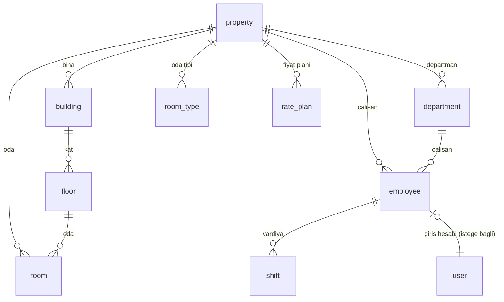
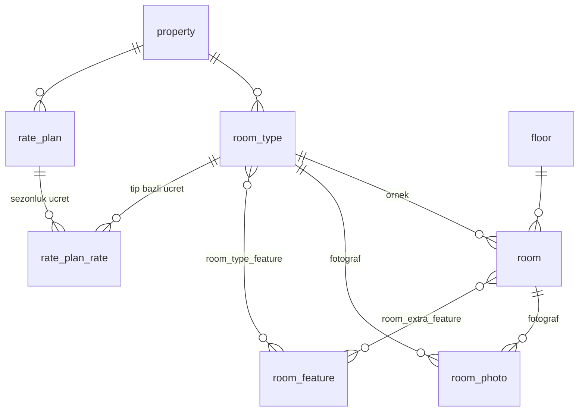
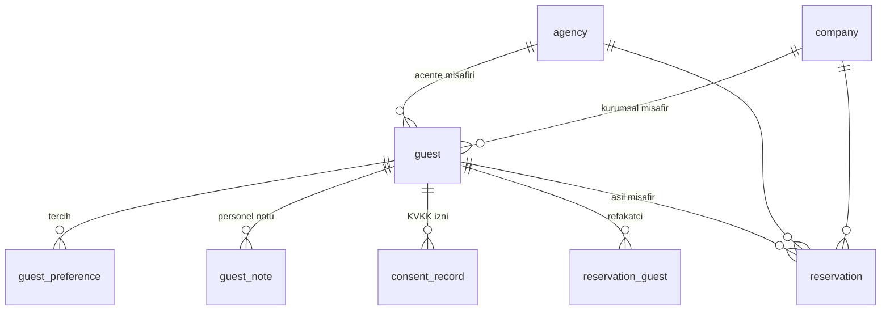
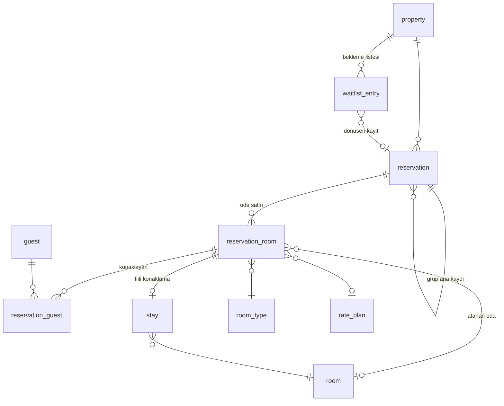
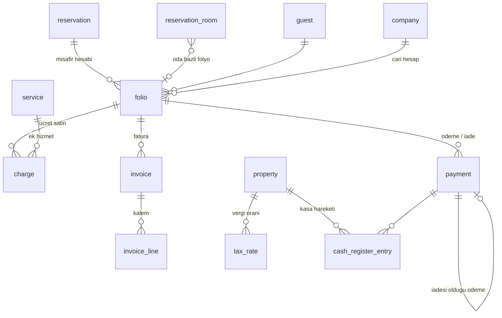
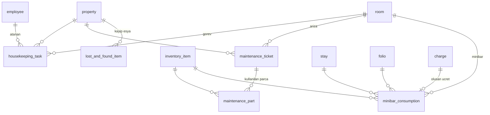
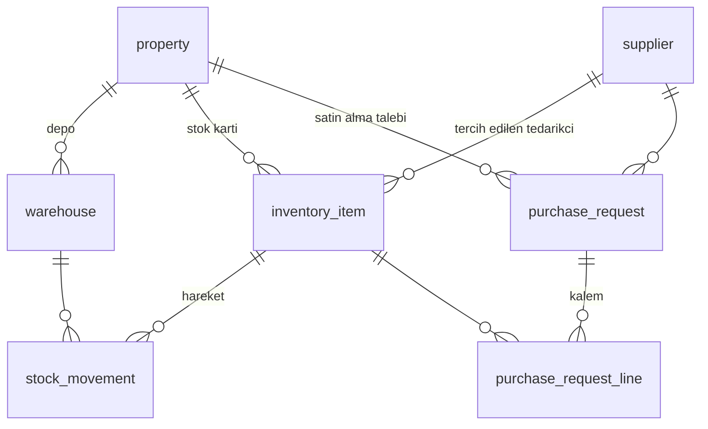
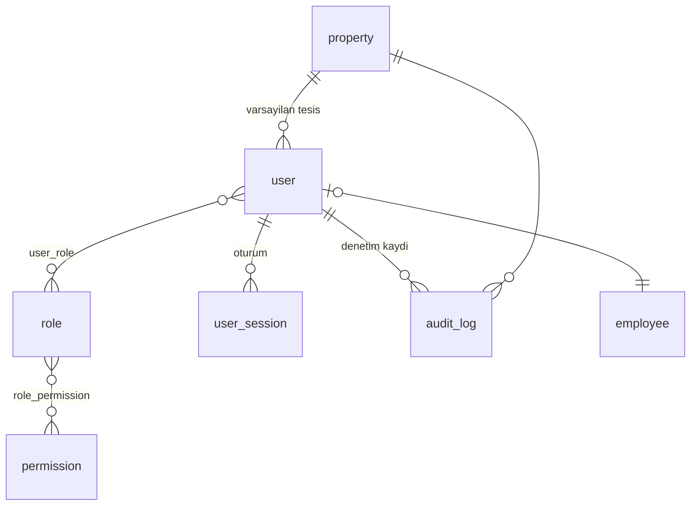
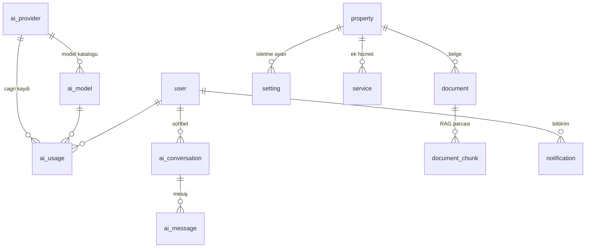

# Veritabanı Şeması

Bu belge şemayı **kaynak koddan** anlatır: her tablo
`app/infrastructure/db/models/` altındaki bir ORM sınıfına karşılık gelir
ve buradaki açıklamaların çoğu modellerdeki `doc=` alanlarından alınmıştır.

Motor: SQLite (varsayılan) / PostgreSQL (isteğe bağlı, **denenmedi** —
bkz. bölüm 9). ORM: SQLAlchemy 2.x. Göç: Alembic.

---

## 1. Genel bakış

```powershell
.\.venv\Scripts\python.exe -c "from app.infrastructure.db.models import Base, ALL_MODELS; print(len(Base.metadata.tables), len(ALL_MODELS))"
# 60 56
```

| Ölçüm | Değer |
|---|---|
| Toplam tablo (`Base.metadata`) | **60** |
| ORM model sınıfı (`ALL_MODELS`) | 56 |
| Çok-çok bağlantı tablosu (sınıfsız) | 4 |
| Göç sürümü | tek revizyon: `f146f60a83d9` — *ilk sema* |
| Gerçek veritabanı dosyasındaki tablo | 61 (60 + `alembic_version`) |

Dört bağlantı tablosunun ORM sınıfı yoktur, `Table(...)` ile tanımlıdır:
`room_type_feature`, `room_extra_feature` (`models/rooms.py`) ve
`user_role`, `role_permission` (`models/security.py`).

### Gruplar

| Grup | Modül | Tablo | Tablolar |
|---|---|---|---|
| Organizasyon | `models/organization.py` | 6 | `property`, `building`, `floor`, `department`, `employee`, `shift` |
| Oda | `models/rooms.py` | 6 + 2 | `room_type`, `room`, `room_feature`, `room_photo`, `rate_plan`, `rate_plan_rate` + `room_type_feature`, `room_extra_feature` |
| Misafir | `models/guests.py` | 6 | `guest`, `company`, `agency`, `guest_preference`, `guest_note`, `consent_record` |
| Rezervasyon | `models/reservations.py` | 5 | `reservation`, `reservation_room`, `reservation_guest`, `stay`, `waitlist_entry` |
| Finans | `models/billing.py` | 7 | `folio`, `charge`, `payment`, `invoice`, `invoice_line`, `tax_rate`, `cash_register_entry` |
| Operasyon | `models/operations.py` | 5 | `housekeeping_task`, `maintenance_ticket`, `maintenance_part`, `lost_and_found_item`, `minibar_consumption` |
| Stok | `models/inventory.py` | 6 | `warehouse`, `supplier`, `inventory_item`, `stock_movement`, `purchase_request`, `purchase_request_line` |
| Güvenlik | `models/security.py` | 5 + 2 | `user`, `role`, `permission`, `user_session`, `audit_log` + `user_role`, `role_permission` |
| Yapay zekâ | `models/ai.py` | 6 | `ai_provider`, `ai_model`, `ai_usage`, `ai_conversation`, `ai_message`, `document_chunk` |
| Sistem | `models/system.py` | 4 | `notification`, `setting`, `service`, `document` |
| | | **60** | |

> **Çok tesisli kurgu.** Veri modeli baştan çok tesisli (multi-property)
> tasarlanmıştır: operasyonel kayıtların çoğu bir `property` altında
> toplanır. Tek otel kullanan işletme için bu yalnızca tek bir satır
> demektir; zincire büyüme durumunda şema değişikliği gerekmez.

---

## 2. Ortak temeller

### Birincil anahtar ve tablo adı

`Base` (`app/infrastructure/db/base.py`) her modele tamsayı `id` verir ve
tablo adını sınıf adından türetir:

```
ReservationGuest -> reservation_guest
AIProvider       -> ai_provider
AIUsage          -> ai_usage
```

Basit "her büyük harften önce alt çizgi" yaklaşımı `AIProvider` için
`a_i_provider`, "önceki harf büyükse atla" yaklaşımı ise `aiprovider`
üretirdi; ikisi de yanlıştır. Bu yüzden `_to_snake_case()` iki aşamalı
düzenli ifade kullanır.

### Mixin'ler

| Mixin | Eklediği sütunlar | Kullanan model sayısı |
|---|---|---|
| `TimestampMixin` | `created_at` (index), `updated_at` — ikisi de `TZDateTime`, UTC | 54 |
| `ActiveMixin` | `is_active` (index) — kayıt silinmeden kullanımdan kaldırılır | 19 |
| `NotesMixin` | `notes` `String(2000)` | 30 |
| `SoftDeleteMixin` | `is_deleted` (index), `deleted_at`, `deleted_by_user_id` | **yalnızca 2**: `guest`, `reservation` |
| *(hiçbiri)* | — | `audit_log`, `ai_usage` — append-only, kendi `created_at` alanlarını tutar |

### Özel sütun tipleri

| Tip | Nerede | Ne yapar |
|---|---|---|
| `TZDateTime` | Tüm tarih-saat sütunları | Yazarken naive değeri UTC kabul eder, okurken UTC olarak işaretler. SQLite `DATETIME` zaman dilimi taşımadığı için gereklidir; aksi hâlde oturum süresi kontrolünde `TypeError: can't compare offset-naive and offset-aware datetimes` alınır. |
| `EncryptedString(512)` | `guest.identity_number` | Fernet ile şifreler; veritabanı dosyası kopyalansa bile anahtar olmadan okunamaz. `length` **saklama** uzunluğudur, düz metin uzunluğu değil. |
| `enum_column(...)` | Tüm enum sütunları | `native_enum=False` → `VARCHAR` + `CHECK`. Taşınabilir ve göç dostu; veritabanına enum'un **değeri** (`"confirmed"`) yazılır. |

### İsimlendirme kuralı

```python
NAMING_CONVENTION: dict[str, str] = {
    "ix": "ix_%(column_0_N_label)s",
    "uq": "uq_%(table_name)s_%(column_0_N_name)s",
    "ck": "ck_%(table_name)s_%(constraint_name)s",
    "fk": "fk_%(table_name)s_%(column_0_N_name)s_%(referred_table_name)s",
    "pk": "pk_%(table_name)s",
}
```

SQLite, isimsiz kısıtları `ALTER TABLE` ile değiştiremez. Alembic bir
sütunu değiştirmek istediğinde tabloyu yeniden oluşturur ve bunun için
kısıtların **adı olmalıdır**. Bu sözlük her kısıta öngörülebilir bir ad
verir; `render_as_batch=True` ile birlikte göçler SQLite üzerinde de
sorunsuz çalışır (bkz. bölüm 8).

---

## 3. İlişki diyagramları

### 3.1 Organizasyon



`Employee` ↔ `User` bağı **bire bir ama zorunlu değildir**: her çalışanın
sisteme girişi olmak zorunda değildir (kat görevlisi yalnızca görev
listesinde görünür).

### 3.2 Oda ve fiyat



Fiyatlandırma ve müsaitlik hesapları **oda tipi düzeyinde** yapılır; tek
tek odalar aynı tipin birbirinin yerine geçebilen örnekleridir.
`rate_plan_rate.weekday_mask` haftanın günlerini bit olarak tutar
(bit 0 = Pazartesi … bit 6 = Pazar; varsayılan 127 = tüm günler).

### 3.3 Misafir



Misafirler **tesisten bağımsızdır**: aynı misafir zincirin farklı
tesislerinde konaklayabilir ve CRM geçmişi bütünleşik kalır.

### 3.4 Rezervasyon



**Kritik ayrım:** tarih aralığı ve fiyat `reservation` başlığında değil,
`reservation_room` satırlarında tutulur. Başlıktaki `check_in_date` /
`check_out_date` yalnızca türetilmiş bir özettir (en erken giriş / en geç
çıkış). Çakışma kontrolü bu yüzden **oda satırı düzeyinde** yapılır.

`Stay` ise *gerçekleşeni* temsil eder: `Reservation` planlanan, `Stay`
fiili konaklamadır; erken/geç çıkış gibi sapmalar burada görünür.

### 3.5 Finans



Bakiye her zaman `toplam ücret − toplam ödeme` olarak
`Folio.recalculate()` ile yeniden hesaplanır ve `is_void` satırlar hesaba
katılmaz.

> `invoice` tablosundaki `einvoice_uuid`, `einvoice_ettn`,
> `einvoice_status`, `einvoice_sent_at` alanları yalnızca **veri modeli**
> olarak hazırdır. Gerçek GİB entegrasyonu **yapılmamıştır**; bu alanlar
> bir entegratör eklendiğinde doldurulacaktır (bkz. `docs/ROADMAP.md`).

### 3.6 Operasyon



`maintenance_ticket.blocks_room = True` olan ve henüz kapanmamış kayıtlar
odayı satışa kapatır — odanın `housekeeping_status` alanı güncellenmemiş
olsa bile. Gerekçe `RoomRepository.blocks_for_range()` docstring'inde:
teknik servis arıza açtığında oda durumu her zaman anında güncellenmez,
personel unutabilir; arıza kaydı tek başına da odayı kapatabilmelidir.

### 3.7 Stok



`inventory_item.current_stock` **denormalize bir özettir**; gerçek doğruluk
kaynağı `stock_movement` satırlarıdır. Hareket eklendiğinde servis katmanı
bu alanı günceller. `stock_movement.quantity` her zaman pozitiftir; yön
`movement_type.sign` üzerinden gelir ve `stock_after` denetim izi için
saklanır.

### 3.8 Güvenlik



Kullanıcı → Rol(ler) → İzin(ler) şeklinde iki aşamalı RBAC. Kod içinde
izin **kodu** kontrol edilir (`reservation.create`), rol adı değil; böylece
yeni bir rol tanımlandığında kod değiştirmek gerekmez. Bugün 72 izin ve 7
sistem rolü tanımlıdır (`admin`, `manager`, `frontdesk`, `housekeeping`,
`maintenance`, `accounting`, `viewer`).

`user_session` tablosunda oturum jetonunun kendisi değil **hash'i**
saklanır (`token_hash`, `String(64)`); veritabanı sızsa bile mevcut
oturumlar ele geçirilemez.

### 3.9 Yapay zekâ ve sistem



`ai_provider` tablosu **API anahtarı içermez**; yalnızca anahtarın
keyring'de hangi ad altında arandığını (`secret_name`) tutar. Gerçek değer
Windows Credential Manager'dadır.

`ai_usage` append-only'dir ve **istem/yanıt metinlerini saklamaz**; misafir
verisi içeren istemlerin kalıcı olarak birikmesini önlemek için yalnızca
jeton sayısı, gecikme, maliyet ve hata bilgisi tutulur.

`setting` tablosu ile `.env` arasındaki ayrım: `.env` **kurulum**
düzeyindedir (veritabanı adresi, log seviyesi), `setting` ise **işletme**
düzeyindeki, arayüzden değiştirilen ayarları tutar (varsayılan KDV oranı,
erken giriş ücreti vb.).

> `document_chunk` tablosu RAG için hazırdır (`embedding` sütunu `float32`
> vektörü `LargeBinary` olarak saklar) ancak **indeksleme kodu
> yazılmamıştır**: model docstring'inin atıf yaptığı `app.ai.rag.store`
> modülü depoda yoktur.

---

## 4. Önemli tabloların sütunları

Aşağıdaki tablolarda `TimestampMixin`/`ActiveMixin`/`NotesMixin`/
`SoftDeleteMixin` sütunları tekrar edilmemiştir (bkz. bölüm 2).

### 4.1 `property`

| Sütun | Tip | Açıklama |
|---|---|---|
| `id` | `Integer` PK | |
| `code` | `String(20)` unique, index | Kısa tesis kodu, ör. `MRK01` |
| `name` | `String(200)` index | |
| `property_type` | `PropertyType` | Varsayılan `hotel` |
| `star_rating` | `Integer?` | 1–5 yıldız |
| `address_line`, `district`, `city`, `postal_code` | `String` | `city` indeksli |
| `country` | `String(100)` | Varsayılan `Turkiye` |
| `phone`, `email`, `website` | `String` | |
| `tax_office`, `tax_number` | `String` | |
| `default_currency` | `Currency(10)` | Varsayılan `TRY` |
| `check_in_time` | `Time` | Standart giriş saati (varsayılan 14:00) |
| `check_out_time` | `Time` | Standart çıkış saati (varsayılan 12:00) |
| `timezone` | `String(50)` | Varsayılan `Europe/Istanbul` |
| `logo_path` | `String(400)?` | |

### 4.2 `room`

| Sütun | Tip | Açıklama |
|---|---|---|
| `property_id` | FK `property.id`, index | |
| `room_type_id` | FK `room_type.id`, index | |
| `floor_id` | FK `floor.id` (SET NULL), index | |
| `number` | `String(20)` | Oda numarası, ör. `101`, `A-12` |
| `name` | `String(120)?` | |
| `view` | `RoomView` | Varsayılan `none` |
| `occupancy_status` | `RoomOccupancyStatus`, index | Varsayılan `vacant` |
| `housekeeping_status` | `RoomHousekeepingStatus`, index | Varsayılan `clean` |
| `out_of_service_from` | `Date?` | |
| `out_of_service_until` | `Date?` | Bu tarihe kadar satışa kapalı **(dahil)** |
| `out_of_service_reason` | `String(300)?` | |
| `is_smoking` | `Boolean` | |
| `is_accessible` | `Boolean` | Engelli erişimine uygun |
| `is_connecting` | `Boolean` | Ara kapılı oda |
| `connecting_room_id` | FK `room.id` (SET NULL) | |

Kısıtlar: `uq_room_property_number(property_id, number)`,
`ix_room_status(housekeeping_status, occupancy_status)`.

### 4.3 `reservation`

| Sütun | Tip | Açıklama |
|---|---|---|
| `property_id` | FK `property.id`, index | |
| `confirmation_number` | `String(20)` unique, index | Misafire verilen onay numarası (`RZV-2026-000123`) |
| `status` | `ReservationStatus`, index | Varsayılan `draft` |
| `source` | `ReservationSource`, index | Varsayılan `direct` |
| `source_reference` | `String(80)?` | Kanal tarafındaki rezervasyon numarası |
| `primary_guest_id` | FK `guest.id`, index | |
| `company_id`, `agency_id` | FK (SET NULL), index | |
| `check_in_date` | `Date`, index | **Türetilmiş özet** — oda satırlarının en erken girişi |
| `check_out_date` | `Date`, index | **Türetilmiş özet** — en geç çıkış |
| `expected_arrival_time`, `expected_departure_time` | `Time?` | |
| `adults`, `children`, `infants` | `Integer` | Özet (oda satırlarından toplanır) |
| `currency` | `Currency(10)` | |
| `total_amount` | `Numeric(14,2)` | Oda satırlarının toplamı (vergi dahil) |
| `deposit_amount` | `Numeric(14,2)` | Talep edilen depozito |
| `deposit_paid` | `Boolean` | |
| `paid_amount` | `Numeric(14,2)` | |
| `group_name` | `String(150)?`, index | |
| `group_master_id` | FK `reservation.id` (SET NULL) | Grup ana rezervasyonu; alt kayıtlar buna bağlanır |
| `special_requests` | `Text?` | |
| `cancelled_at` | `TZDateTime?` | |
| `cancellation_reason` | `String(400)?` | |
| `cancelled_by_user_id` | FK `user.id` (SET NULL) | |
| `no_show_marked_at` | `TZDateTime?` | |
| `created_by_user_id` | FK `user.id` (SET NULL) | |

Ek indeksler: `ix_reservation_dates(check_in_date, check_out_date)`,
`ix_reservation_status_property(property_id, status)`.

### 4.4 `reservation_room` — müsaitliğin ve fiyatın gerçek taşıyıcısı

| Sütun | Tip | Açıklama |
|---|---|---|
| `reservation_id` | FK `reservation.id` (CASCADE), index | |
| `room_type_id` | FK `room_type.id`, index | |
| `room_id` | FK `room.id` (SET NULL), index | Atanan fiziksel oda. Oda tipi bazlı rezervasyonlarda giriş anına kadar **boş olabilir** |
| `rate_plan_id` | FK `rate_plan.id` (SET NULL) | |
| `check_in_date` | `Date`, index | Gerçek giriş tarihi (yarı açık aralığın başı) |
| `check_out_date` | `Date`, index | Çıkış tarihi — **konaklamaya dahil değildir** |
| `adults`, `children`, `infants` | `Integer` | |
| `meal_plan` | `MealPlan` | Varsayılan `bed_breakfast` |
| `nightly_rate` | `Numeric(12,2)` | Ortalama gecelik ücret (bilgi amaçlı) |
| `total_amount` | `Numeric(14,2)` | Bu oda satırının toplam tutarı |
| `discount_percent` | `Numeric(5,2)` | |
| `is_cancelled` | `Boolean`, index | Yalnızca bu oda satırı iptal edildi |
| `guest_name_override` | `String(150)?` | Oda kartı için farklı isim yazdırılacaksa |

Ek indeksler:
`ix_resroom_room_dates(room_id, check_in_date, check_out_date)`,
`ix_resroom_type_dates(room_type_id, check_in_date, check_out_date)`.

### 4.5 `stay` — fiili konaklama

| Sütun | Tip | Açıklama |
|---|---|---|
| `reservation_room_id` | FK (CASCADE), **unique**, index | Bir oda satırının en fazla bir konaklaması olur |
| `room_id` | FK `room.id`, index | |
| `status` | `StayStatus`, index | Varsayılan `in_house` |
| `actual_check_in` | `TZDateTime`, index | |
| `actual_check_out` | `TZDateTime?`, index | `NULL` ise misafir hâlâ otelde |
| `key_card_count`, `key_cards_returned` | `Integer` | |
| `is_early_check_in`, `is_late_check_out` | `Boolean` | |
| `early_check_in_fee`, `late_check_out_fee` | `Numeric(12,2)` | |
| `damage_reported` | `Boolean` | |
| `damage_description` | `Text?` | |
| `damage_charge` | `Numeric(12,2)` | |
| `checked_in_by_user_id`, `checked_out_by_user_id` | FK `user.id` (SET NULL) | |

### 4.6 `folio` — misafir hesabı

| Sütun | Tip | Açıklama |
|---|---|---|
| `property_id` | FK, index | |
| `folio_number` | `String(24)` unique, index | |
| `reservation_id` | FK (SET NULL), index | |
| `reservation_room_id` | FK (SET NULL) | Oda bazlı ayrı folyo tutuluyorsa |
| `guest_id` | FK (SET NULL), index | |
| `company_id` | FK (SET NULL) | Cari hesaba (*city ledger*) aktarılan folyolar için |
| `status` | `FolioStatus`, index | Varsayılan `open` |
| `currency` | `Currency(10)` | |
| `total_charges`, `total_payments` | `Numeric(14,2)` | `recalculate()` ile hesaplanır |
| `balance` | `Numeric(14,2)` | **Pozitif = misafir borçlu** |
| `opened_at`, `closed_at` | `TZDateTime?` | |
| `closed_by_user_id` | FK `user.id` (SET NULL) | |

> Bileşik indeks adı bilerek `ix_folio_property_status`'tur:
> isimlendirme kuralı `status` sütununun kendi indeksiyle çakışıp
> `ix_folio_status` verirdi ve SQLite *"index already exists"* hatası
> üretirdi. Gerekçe modeldeki yorumda yazılıdır.

### 4.7 `charge` — ücret satırı

| Sütun | Tip | Açıklama |
|---|---|---|
| `folio_id` | FK (CASCADE), index | |
| `charge_type` | `ChargeType`, index | Oda, yiyecek-içecek, minibar, SPA … |
| `service_id` | FK `service.id` (SET NULL) | Hizmet bazlı gelir raporu için |
| `description` | `String(300)` | |
| `charge_date` | `Date`, index | |
| `quantity` | `Numeric(10,3)` | |
| `unit_price` | `Numeric(12,2)` | |
| `net_amount` | `Numeric(14,2)` | **Vergi hariç** tutar |
| `tax_rate_percent` | `Numeric(5,2)` | |
| `tax_amount` | `Numeric(14,2)` | |
| `total_amount` | `Numeric(14,2)` | **Vergi dahil** toplam |
| `is_void` | `Boolean`, index | Silme yerine geçersiz kılma |
| `void_reason` | `String(300)?` | Zorunlu — servis gerekçesiz kabul etmez |
| `voided_at` | `TZDateTime?` | |
| `voided_by_user_id`, `posted_by_user_id` | FK `user.id` (SET NULL) | |
| `reference` | `String(80)?` | Restoran adisyon no, minibar fişi vb. |

Ek indeksler: `ix_charge_folio_date(folio_id, charge_date)`,
`ix_charge_type_date(charge_type, charge_date)`.

### 4.8 `payment` — ödeme / iade

| Sütun | Tip | Açıklama |
|---|---|---|
| `folio_id` | FK (CASCADE), index | |
| `method` | `PaymentMethod`, index | |
| `status` | `PaymentStatus`, index | Varsayılan `paid` |
| `amount` | `Numeric(14,2)` | |
| `currency` | `Currency(10)` | |
| `exchange_rate` | `Numeric(12,6)` | Tesis para birimine çevrim kuru |
| `paid_at` | `TZDateTime`, index | |
| `reference` | `String(120)?` | İşlem/dekont numarası. **Kart numarası yazılmaz** |
| `card_last_four` | `String(4)?` | **Yalnızca son 4 hane**; tam kart numarası asla saklanmaz |
| `is_refund` | `Boolean`, index | |
| `refund_of_payment_id` | FK `payment.id` (SET NULL) | |
| `is_deposit` | `Boolean` | |
| `received_by_user_id` | FK `user.id` (SET NULL) | |

Ek indeks: `ix_payment_folio_date(folio_id, paid_at)`.

### 4.9 `guest`

| Sütun | Tip | Açıklama |
|---|---|---|
| `title` | `GuestTitle` | |
| `first_name`, `last_name` | `String(80)`, index | |
| `birth_date` | `Date?` | |
| `nationality` | `String(100)` | Varsayılan `Turkiye` |
| `preferred_language` | `String(5)` | Varsayılan `tr` |
| `identity_document_type` | `IdentityDocumentType` | Varsayılan `national_id` |
| `identity_number` | **`EncryptedString(512)`** | **ŞİFRELİ** saklanır; düz metin olarak loglanmaz veya dışa aktarılmaz |
| `identity_index` | `String(44)`, index, unique | Kimlik numarasının **kör indeksi** — eşitlik araması için (HMAC-SHA256) |
| `identity_expiry` | `Date?` | |
| `identity_issuing_country` | `String(100)?` | |
| `email` | `String(200)?`, index | |
| `phone` | `String(40)?`, index | |
| `mobile`, `address_line`, `city`, `postal_code`, `country` | `String` | |
| `vip_level` | `VIPLevel`, index | |
| `company_id`, `agency_id` | FK (SET NULL), index | |
| `is_blacklisted` | `Boolean`, index | Kara listede — yeni rezervasyon uyarısı verir |
| `blacklist_reason` | `String(400)?` | |
| `blacklisted_at` | `TZDateTime?` | |
| `total_stays`, `total_nights`, `no_show_count`, `cancellation_count` | `Integer` | **Denormalize CRM özeti** (rapor performansı için) |
| `total_revenue` | `Numeric(14,2)` | Denormalize |
| `first_stay_date`, `last_stay_date` | `Date?` | Denormalize |

Kısıtlar: `uq_guest_identity_index(identity_index)`,
`ix_guest_name(last_name, first_name)`, `ix_guest_contact(email, phone)`.

Kimlik numarası ve kör indeks **birlikte** güncellenmelidir; giriş noktası
`Guest.set_identity(number)` yardımcısıdır — ikisini elle ayrı yazmak
indeksin sessizce eskimesine yol açar.

### 4.10 `user`

| Sütun | Tip | Açıklama |
|---|---|---|
| `username` | `String(60)` unique, index | |
| `email` | `String(200)?` unique | |
| `full_name` | `String(150)` | |
| `password_hash` | `String(255)` | **Argon2id hash.** Düz parola ASLA saklanmaz |
| `must_change_password` | `Boolean` | İlk girişte veya yönetici sıfırlamasından sonra `True` |
| `password_changed_at` | `TZDateTime?` | |
| `is_superuser` | `Boolean` | Tüm izinlere sahip; yalnızca kurulum yöneticisi için |
| `default_property_id` | FK `property.id` (SET NULL) | |
| `last_login_at` | `TZDateTime?` | |
| `last_login_ip` | `String(45)?` | IPv6 sığacak uzunluk |
| `failed_login_count` | `Integer` | Kaba kuvvet sayacı |
| `locked_until` | `TZDateTime?` | Bu ana kadar giriş denemeleri reddedilir |
| `language` | `String(5)` | Varsayılan `tr` |
| `theme` | `String(10)` | Varsayılan `dark` |

Ek indeks: `ix_user_login(username, is_active)` — giriş sorgusu tam olarak
bu iki sütunu birlikte süzer.

---

## 5. Şifreli ve hassas alanlar

| Tablo.sütun | Koruma | Not |
|---|---|---|
| `guest.identity_number` | **Fernet ile şifreli** (`EncryptedString`) | Veritabanı dosyası kopyalansa bile anahtarsız okunamaz. Anahtar kaybedilirse veri **geri getirilemez** |
| `guest.identity_index` | HMAC-SHA256 **kör indeks** | Şifreli sütunda eşitlik araması yapabilmek için. Anahtarı bilmeyen sözlük saldırısıyla çözemez |
| `user.password_hash` | **Argon2id** | Tek yönlü; düz parola hiçbir yerde saklanmaz veya loglanmaz |
| `user_session.token_hash` | Jetonun **hash'i** | Jetonun kendisi saklanmaz |
| `payment.card_last_four` | Yalnızca son 4 hane | Tam kart numarası asla saklanmaz |
| `payment.reference` | Politika | Dekont numarası içindir; kart numarası yazılmaz |
| `ai_provider.secret_name` | Yalnızca **ad** | API anahtarı Windows Credential Manager'dadır, tabloda değil |
| `audit_log.before_data` / `after_data` | `_sanitize()` ile maskelenir | `app/security/audit.py`; bazı alanlar hiçbir koşulda yazılmaz, kalanlar `mask_value()` ile maskelenir |
| `ai_usage` (tablo geneli) | İstem/yanıt metni **saklanmaz** | Misafir verisi içeren istemlerin birikmesini önlemek için |
| `setting.is_sensitive` | Bayrak — **henüz uygulanmıyor** | Model `doc=` alanı "arayüzde maskelenir ve loglanmaz" diyor; sütun `app/` altında **hiçbir yerde okunmuyor** |
| `document.is_sensitive` | Bayrak — **henüz uygulanmıyor** | Model `doc=` alanı "yapay zekâya gönderilmez" diyor; sütun `app/` altında **hiçbir yerde okunmuyor** |

> **Uyarı — iki bayrak henüz bir şey yapmıyor.** `setting.is_sensitive` ve
> `document.is_sensitive` sütunları tanımlıdır ve model docstring'lerinde
> koruma vaadi taşır, ancak kaynak kodda **hiçbir yerde okunmazlar**:
>
> ```powershell
> Get-ChildItem app -Recurse -File -Filter *.py | Select-String -Pattern "is_sensitive"
> # yalnizca app\infrastructure\db\models\system.py:111 ve :201 (tanimlar)
> ```
>
> Yani hassas işaretli bir belge bugün yapay zekâya gönderilmekten
> otomatik olarak korunmaz. Bu ayrım veri modeli düzeyinde hazırdır,
> davranış düzeyinde **değildir**.

Şifreleme anahtarının yeri ve yedeklenmesi:

- Anahtar `app/core/secret_store.py` üzerinden **Windows Credential
  Manager**'da tutulur (`field_encryption_key`).
- Keyring hiç kullanılamıyorsa (ör. CI) `HOTEL_FIELD_ENCRYPTION_KEY` ortam
  değişkenine bakılır.
- **`scripts/backup.ps1` anahtarı yedeklemez.** Yönetici anahtarı ayrıca
  güvenli bir yerde saklamalıdır; kaybedilirse şifreli kişisel veriler
  geri getirilemez.

Doğrulama testleri: `tests/infrastructure/test_encryption.py` — özellikle
`test_kimlik_numarasi_diskte_duz_metin_degil` ham SQL ile diskteki değeri
okur ve düz metin olmadığını doğrular.

---

## 6. İndeksler ve neden var oldukları

Gerçek veritabanı dosyasında **279 açık indeks** (`sqlite_master`,
`sql IS NOT NULL`) ve 23 otomatik (UNIQUE kısıtından doğan) indeks vardır.
Çoğu `index=True` verilmiş tekil sütun indeksidir; aşağıda **bileşik**
olanlar ve gerekçeleri listelidir.

> Tablo düzeyindeki `UniqueConstraint` adları (`uq_room_property_number`,
> `uq_guest_identity_index`, `uq_rate_plan_property_code` …) SQLite'ta ayrı
> bir indeks nesnesi olarak görünmez; motor bunları
> `sqlite_autoindex_<tablo>_<n>` biçiminde gerçekleştirir. Adların önemi
> göç tarafındadır (bkz. bölüm 2 ve 8), sorgu planlamada değil.

### Çakışma sorgusunun indeksleri

```sql
-- ReservationRepository.bookings_for_range / bookings_for_room
CREATE INDEX ix_resroom_room_dates
    ON reservation_room (room_id, check_in_date, check_out_date);
```

Çakışma sorgusu şu biçimdedir:

```
WHERE reservation_room.room_id = ?
  AND reservation_room.check_in_date  < :aralik_sonu
  AND reservation_room.check_out_date > :aralik_basi
```

Eşitlik süzgeci (`room_id`) indeksin **ilk** sütunudur; ardından tarih
aralığı taranır. Süzgeci Python'da uygulamak da kolay olurdu — SQL'de
olmasının nedeni yüksek sezonda tabloda on binlerce satır bulunması ve bu
indeksin ancak böyle kullanılabilmesidir.

`ix_resroom_type_dates(room_type_id, check_in_date, check_out_date)` ise
oda tipi bazlı müsaitlik/tahmin sorguları içindir (henüz oda atanmamış
satırlar da bu yolla sayılabilir).

### Diğer bileşik indeksler

| İndeks | Tablo | Hangi sorgu için |
|---|---|---|
| `ix_reservation_dates` | `reservation` | Takvim/liste ekranında dönem süzgeci |
| `ix_reservation_status_property` | `reservation` | "Bu tesiste onaylı rezervasyonlar" |
| `ix_room_status` | `room` | Kat hizmetleri panosu: temizlik + doluluk durumu birlikte |
| `ix_folio_property_status` | `folio` | Açık folyoların tesis bazlı listesi |
| `ix_charge_folio_date` | `charge` | Folyo ekranında tarihe göre sıralı ücret dökümü |
| `ix_charge_type_date` | `charge` | Ücret türü bazlı gelir raporu |
| `ix_payment_folio_date` | `payment` | Folyo ödeme geçmişi |
| `ix_guest_name` | `guest` | Soyad + ad ile misafir arama |
| `ix_guest_contact` | `guest` | E-posta/telefon ile arama |
| `ix_user_login` | `user` | Giriş: `username = ? AND is_active = 1` |
| `ix_session_active` | `user_session` | Geçerli oturum kontrolü (`user_id`, `is_revoked`, `expires_at`) |
| `ix_audit_entity` | `audit_log` | "Bu rezervasyonda ne oldu?" |
| `ix_audit_user_time` | `audit_log` | "Bu kullanıcı ne yaptı?" |
| `ix_audit_action_time` | `audit_log` | Eylem türüne göre zaman çizelgesi |
| `ix_rate_lookup` | `rate_plan_rate` | Fiyat çözümlemesi (plan + tip + tarih aralığı) |
| `ix_hk_task_date_status` / `ix_hk_task_assignee` | `housekeeping_task` | Günlük görev listesi / personel görev listesi |
| `ix_maint_status_priority` / `ix_maint_room` | `maintenance_ticket` | Açık arıza kuyruğu / odaya göre arıza |
| `ix_inventory_low_stock` | `inventory_item` | Kritik stok uyarısı |
| `ix_stock_move_item_date` / `ix_stock_move_type` | `stock_movement` | Ürün hareket dökümü / hareket türü raporu |
| `ix_ai_usage_time`, `ix_ai_usage_task`, `ix_ai_usage_provider` | `ai_usage` | Kullanım/maliyet raporları |
| `ix_notification_user_read` | `notification` | Okunmamış bildirim rozeti |
| `ix_consent_guest_type` | `consent_record` | KVKK izin denetimi |
| `ix_chunk_document` | `document_chunk` | Belge parçalarının sıralı okunması |

İndeks listesini kendiniz doğrulamak için:

```powershell
.\.venv\Scripts\python.exe -c "import sqlite3; c=sqlite3.connect('data/hotel.db'); print([r[0] for r in c.execute('select name from sqlite_master where type=? and tbl_name=?', ('index','reservation_room'))])"
```

Çıktı (demo veritabanında):

```
['ix_reservation_room_check_in_date', 'ix_reservation_room_check_out_date',
 'ix_reservation_room_created_at', 'ix_reservation_room_is_cancelled',
 'ix_reservation_room_reservation_id', 'ix_reservation_room_room_id',
 'ix_reservation_room_room_type_id', 'ix_resroom_room_dates',
 'ix_resroom_type_dates']
```

---

## 7. SQLite bağlantı ayarları

`app/infrastructure/db/session.py` her yeni bağlantıda şu PRAGMA'ları
uygular:

| PRAGMA | Değer | Neden |
|---|---|---|
| `foreign_keys` | `ON` | **SQLite'ta yabancı anahtarlar varsayılan olarak kapalıdır.** Açılmazsa silinen bir odaya bağlı rezervasyonlar sessizce yetim kalır |
| `journal_mode` | `WAL` | Okuyucular yazıcıları engellemez — arayüz ile arka plan görevi aynı anda çalışabilir |
| `synchronous` | `NORMAL` | Dayanıklılık/hız dengesi; WAL ile birlikte güvenli kabul edilir |
| `busy_timeout` | `5000` | Kilitli veritabanında 5 sn bekle |
| `temp_store` | `MEMORY` | Geçici tabloları bellekte tut |

> **Yedekleme uyarısı.** WAL kipinde veritabanı dosyasını kopyalamak
> tutarsız yedek üretir. Bu yüzden yedek `app/infrastructure/backup.py`
> içinde `VACUUM INTO` ile alınır (`scripts/backup.ps1` bu kodu çağırır);
> komut tutarlı bir anlık görüntü yazar.

---

## 8. Göç yönetimi (Alembic)

### Mevcut durum

```powershell
.\.venv\Scripts\alembic.exe current
# f146f60a83d9 (head)

.\.venv\Scripts\alembic.exe history
# <base> -> f146f60a83d9 (head), ilk sema
```

Tek bir revizyon vardır: `alembic/versions/2026_08_15_0503-f146f60a83d9_ilk_sema.py`
(4.042 satır, 60 tabloyu birden oluşturur).

### Komutlar

```powershell
# Semayi guncel hale getir
.\.venv\Scripts\alembic.exe upgrade head

# Model degisikliginden goc uret
.\.venv\Scripts\alembic.exe revision --autogenerate -m "oda tipine minimum konaklama eklendi"

# Bir adim geri al
.\.venv\Scripts\alembic.exe downgrade -1

# SQL betigi uret (baglanti acmadan)
.\.venv\Scripts\alembic.exe upgrade head --sql
```

`scripts/setup.ps1` kurulum sırasında `alembic upgrade head` çağırır.

### Yapılandırma ayrıntıları

**1. Bağlantı adresi koda gömülü değildir.** `alembic.ini` içindeki
`sqlalchemy.url` boş bırakılmıştır; adres `alembic/env.py` tarafından
uygulama ayarlarından (`HOTEL_DB_URL` / `.env`) okunur. Böylece gerçek
bağlantı bilgisi depoya girmez.

**2. `render_as_batch=True` — SQLite için ZORUNLU.**

SQLite `ALTER TABLE` işlemlerinin çoğunu desteklemez: sütun silme, tip
değiştirme, kısıt ekleme gibi işlemler doğrudan yapılamaz. Batch kipi,
Alembic'in **tabloyu yeniden oluşturup veriyi kopyalamasını** sağlar. Bu
yeniden oluşturma sırasında kısıtların adlandırılmış olması gerekir —
bölüm 2'deki `NAMING_CONVENTION` tam olarak bunun içindir. İkisinden biri
eksik olursa sütun değiştiren göçler SQLite'ta çalışmaz.

**3. Yeni model dosyası eklerseniz `models/__init__.py`'ye de ekleyin.**
Alembic `--autogenerate` yalnızca `Base.metadata`'ya kayıtlı tabloları
görür; import edilmeyen bir model dosyası göç üretiminde **sessizce
atlanır**.

**4. `include_object`** — SQLite'ın dahili `sqlite_sequence` tablosu ve
`alembic_version` autogenerate çıktısında "silinmiş tablo" gibi görünür;
`env.py` bunları dışlar.

**5. `render_item`** — `EncryptedString` gibi uygulamaya özel tipler göç
dosyasına `app.infrastructure.db.types.EncryptedString(...)` olarak yazılır
ama import satırı üretilmez; göç çalıştığında
`NameError: name 'app' is not defined` alınır. `env.py` modülü
`autogen_context.imports` kümesine ekleyerek bunu önler.

**6. Yabancı anahtar PRAGMA'sı bağlantı olayına bağlıdır.** PRAGMA'yı
`connection.exec_driver_sql(...)` ile çalıştırmak SQLAlchemy 2.0'ın
"commit as you go" modelinde örtülü bir işlem başlatır; Alembic kendi
işlemini açamaz ve göç sonunda `alembic_version` damgası **commit
edilmez** — tablolar oluşur ama `alembic current` boş döner. `env.py`
PRAGMA'yı `connect` olayına bağlayarak bu tuzağı ortadan kaldırır.

**7. Göç dosyaları `black` ile otomatik biçimlendirilir**
(`[post_write_hooks]`). `ruff` burada kullanılamaz: bir Rust ikilisidir ve
Alembic'in beklediği `console_scripts` giriş noktasını sağlamaz. Göç
dosyaları zaten `ruff` ve `mypy` denetiminden muaftır
(`pyproject.toml` → `extend-exclude`).

---

## 9. Veri saklama ve silme

### Mantıksal silme (soft delete)

Otel işletmesinde kayıtlar mali denetim ve geçmiş raporlar için genellikle
**fiziksel olarak silinmez**. `SoftDeleteMixin` yalnızca iki tabloda
kullanılır:

| Tablo | Sütunlar | Sorgularda |
|---|---|---|
| `reservation` | `is_deleted`, `deleted_at`, `deleted_by_user_id` | `Reservation.is_deleted.is_(False)` süzgeci `reservation_repository.py` (4 sorgu), `guest_repository.py` (2) ve `operations_repository.py` (1) içinde uygulanır |
| `guest` | aynı | `Guest.is_deleted` süzgeci `guest_repository.py` (3 sorgu) ve `guest_service.py` (3 yer) içinde uygulanır |

> Süzgeç **otomatik değildir**: SQLAlchemy düzeyinde global bir olay
> dinleyicisi veya `with_loader_criteria` yoktur; her sorgu koşulu kendisi
> yazar. Yeni bir sorgu eklerken süzgeci unutmak, silinmiş kaydın listede
> görünmesine yol açar.

`mark_deleted(user_id)` / `restore()` yardımcıları
`app/infrastructure/db/base.py` içindedir.

### Geçersiz kılma (void) — silme yerine

`charge` satırları **hiçbir koşulda silinmez**. Yanlış işlenen bir ücret
`is_void = True` yapılır, `void_reason` zorunlu olarak yazılır, `voided_at`
ve `voided_by_user_id` doldurulur. `Folio.recalculate()` void satırları
hesaba katmaz. Servis girişi: `FolioService.void_charge(charge_id,
reason=...)` ve `Perm.FOLIO_VOID_CHARGE` yetkisi ister.

### Append-only tablolar

| Tablo | Neden |
|---|---|
| `audit_log` | Denetim günlüğü: kayıtlar güncellenmez veya silinmez. `TimestampMixin` yerine kendi `created_at` alanını tutar, çünkü `updated_at` kavramı burada anlamsızdır. `username` alanı, kullanıcı silinse bile kimin yaptığı bilinsin diye **kopyalanır** |
| `ai_usage` | Kullanım/maliyet kaydı. Aynı gerekçeyle yalnızca `created_at` tutar. `model_name` model silinse bile hangisinin kullanıldığı bilinsin diye kopyalanır |

### Pasife alma (deaktivasyon)

`ActiveMixin` taşıyan 19 tabloda (`room`, `room_type`, `rate_plan`,
`company`, `agency`, `supplier`, `service`, `user`, `role`, `ai_provider`,
`ai_model` …) kayıt silinmeden `is_active = False` ile kullanımdan
kaldırılır. Bu, geçmiş rezervasyonların hâlâ geçerli bir odaya/plana işaret
etmesini sağlar.

### Silme davranışı (`ondelete`)

Yabancı anahtarlarda iki kalıp kullanılır:

- **`CASCADE`** — alt kayıt üst kayıt olmadan anlamsızsa
  (`reservation_room` → `reservation`, `charge` → `folio`,
  `invoice_line` → `invoice`, `ai_message` → `ai_conversation`).
- **`SET NULL`** — bağ koparılabilir ama kayıt korunmalıdır
  (`reservation.cancelled_by_user_id` → `user`, `folio.guest_id` → `guest`,
  `reservation_room.room_id` → `room`).

`PRAGMA foreign_keys=ON` açılmazsa bu davranışların **hiçbiri
uygulanmaz** — bkz. bölüm 7.

---

## 10. Bu belgede doğrulanamayanlar

| Konu | Durum |
|---|---|
| PostgreSQL üzerinde şema | Tipler taşınabilir yazılmıştır (`native_enum=False`, `TZDateTime`, isimlendirilmiş kısıtlar) ancak PostgreSQL ile **çalıştırılmadı**. `psycopg` isteğe bağlı bir bağımlılıktır |
| `document_chunk` / RAG akışı | Tablo ve `embedding` sütunu hazır; `app.ai.rag.store` modülü **depoda yok**, indeksleme kodu yazılmamış |
| e-Fatura alanları | `invoice.einvoice_*` sütunları mevcut; GİB entegrasyonu **yok** |
| Sorgu planları (`EXPLAIN QUERY PLAN`) | İndekslerin varlığı doğrulandı; SQLite'ın bu indeksleri gerçekten seçtiği **ölçülmedi** |
| Büyük veri altında performans | Ölçüm için kullanılan `data/hotel.db` demo veritabanıdır (80 rezervasyon, 40 oda, toplam 1.590 satır). Yüksek sezon yükü altında ölçüm **yapılmadı** |
| `setting.is_sensitive` / `document.is_sensitive` | Sütunlar var, **davranış yok** (bkz. bölüm 5 uyarısı) |

---

## İlgili belgeler

| Belge | İçerik |
|---|---|
| [ARCHITECTURE](ARCHITECTURE.md) | Katmanlar, tasarım kararları, istek akışı, genişletme rehberi |
| [ROADMAP](ROADMAP.md) | Tamamlanmamış modüller ve bilinen teknik eksikler |
| [CONTRIBUTING](../CONTRIBUTING.md) | Kod standartları ve mimari kurallar |
